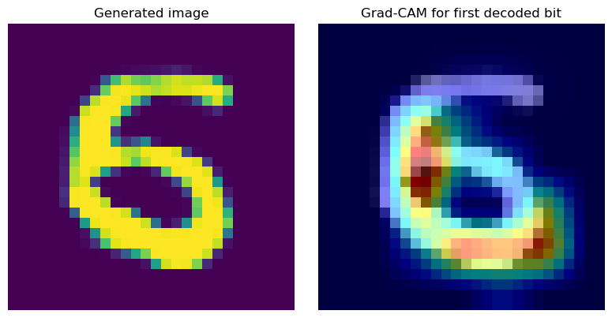

# invisiGAN

## Abstract
We propose a methodology to embed binary sequences into the output of generative AI models, in particular Generative Adversarial Networks (GANs)[1], in ways imperceptible to the eye. Our technique conditions the generator network on a bit vector in addition to random noise, and the generator’s primary loss gradient will be supplied by the discriminator network. In addition, we incorporate a third “probe” network that attempts to decode the binary vector encoded by images created by the generator. This gives us a secondary training target, namely the accurate recovery of the original binary sequence. The job of the generator is to balance the “readability” of generated images whilst preserving its approximation of the original dataset.

We would like to opt in for the Outstanding Project award. [Presentation slides](https://docs.google.com/presentation/d/1x3t7n1I7Aq0qR9unEPTPzDTHHX35oKuUBcWLqDfLLD4/edit?usp=sharing)

## 1. Literature

Generative AI models are capable of reproducing artificial images that replicate existing databases[1]. Incremental developments of these models have allowed for the conditioning of the output of traditional generative networks by representing class labels or other features as additional input to the generator model[2]. We now look at a specific application of the GAN with its usage in hiding arbitrary binary data in images while keeping the changes hard to detect[3]. We will use various methods outlined by Claude Shannon in his “Mathematical Theory of Communication”[4] including rate-distortion theory and mutual information. 

### Dataset Descriptions
The MNIST dataset is a small dataset which contains over 70,000 labeled greyscale images of hand-drawn digits 0 through 9. 
The EMNIST dataset is a superset of MNIST, containing over 800,000 labeled greyscale images of hand-drawn digits, and lowercase and uppercase letters.
### Dataset Links
https://www.kaggle.com/datasets/hojjatk/mnist-dataset
https://www.kaggle.com/datasets/crawford/emnist
## 2. Problem and Motivation

### Problem 
In recent years, the incorporation of steganography into generative models has been explored in models like SteganoGAN[3], which embed messages into the input image undetectable to users but able to be decrypted with a trained model. However, these models cannot be considered to be truly "self-watermarking" models because the addition of the watermark occurs *post-hoc*. In contrast, our method encodes messages as an integral part of image generation, in a way that the message and image are inseparable.
### Motivation
As AI generated content becomes increasingly indistinguishable from reality, the need for users to be confident in the authenticity of the images they see and share online is increasingly important. However, the popularity of these tools derives, fundamentally, from their ability to approximate reality. As such, any method of embedding a “watermark” into the output of a generative model must not disrupt the user experience. 

## 3. Methodology

*LaTeX does not render on GitHub Pages, so view this section from the GitHub repo itself*

We adopt a traditional cGAN training framework[2] that conditions the generator network on a random binary sequence $M$ instead of class labels:

$G(z, M)$ - Generator network

The generator network is trained with two objectives: an adversarial objective supplied by the discriminator, which attempts to distinguish images that were generated versus sampled from the dataset; and an auxiliary objective supplied by the decoder, which attempts to decode the binary message encoded in the generated image:

$A(x)$ - Discriminator (adversarial) network

$D(x)$ - Decoder network

The discriminator loss is calculated via hinge loss between the two classes of data (fake and real), whereas the decoder loss is calculated via binary cross-entropy between each logit of the predicted and original binary sequences. To provide a gradient to the generator for optimization, we perform a weighted average of these losses: 

$L_G = c_{adv}L_A + c_{aux}L_D$

### Data Preprocessing Techniques
Before inputting images to the discriminator and decoder, we normalize them to pixel values between 0 and 1 for stabler gradients. All images in the data pipeline are grayscale (single-channel) and 28 by 28 pixels.

### ML Models/Algorithms
We use convolutional neural networks for the discriminator and decoder, and stacked upscale layers for the generator. All of these are created and optimized via gradient descent using built-in pytorch functions and classes (torch.nn.Linear, torch.nn.Conv2d, torch.optim.Adam, etc.), with error signals also computed using torch.nn.BCELoss.

### Architecture
The generator network consists of stacked upsampling layers that transform the latent vector into a 2d image. Naively, the message vector could simply be concatenated with the latent vector $z$ in order to condition the network $G$ on both $z$ and $M$:

$G(z, M) = G([z,M])$

However, this is a critical error that severely impairs model performance. GANs learn a continuous manifold between high dimensional points (images) in the original dataset, relying on the ability to interpolate between nearby images; if certain dimensions of $z$ are forced to represent the discrete bits of $M$, the smoothness of the latent space is broken and discontinuities are introduced. 

*Latent space interpolation. Pick two random points in the z-space and transition smoothly between them*

To avoid this, we project $M$ into the latent space using a linear transformation. This continuous embedding is then added to $z$ before the first upscale. We repeat these residual "injections" of $M$ after each block so that the generator never loses the information content of $M$.

The discriminator and decoder networks share similar architecture, using stacked convolutional layers to compress the input image into a lower-dimensional feature space. The discriminator has a single output neuron representing the probability of the input image being real or fake. The decoder has $n$ output neurons, with the $i^{th}$ neuron representing the probability that $M_i$ is 0 or 1.

### Supervised Learning Method
Our methodology uses supervised learning methods because both the discriminator and the decoder are trained with labeled data (real vs. fake images, and binary sequences, respectively). The generator is simultaneously trained using signals from these explicit, supervised objectives.

## 4. Results/Discussion

*Sample generated images after 30 epochs, each encoding a 16 bit message.*

### Metrics
We evaluate our system using 3 metrics: Fréchet Inception Distance (FID) to quantify the deviation of the generator's images from the original dataset; Bit Recovery Accuracy to measure the accuracy of the decoder per bit; and Full Recovery Rate to quantify the percentage of payloads decoded perfectly without error. Our goal is to maintain a low FID to ensure high perceptual quality, a high bit rate accurate (>99%), and maximize Exact Match Rate across all generated images. 

Since the adversarial losses values are not directly interpretable, we do not report them numerically. It is more useful to rely on metrics such as FID, which directly quantify generator realism.

*Diagram of FID score (left axis) and full recovery rate (right axis) versus message length, conducted across both image datasets. Mode collapse was observed training the model on MNIST and 32-bit messages.*

### Analysis
We observe a clear negative correlation between the message length and message recoverability. Additionally, we observe a positive correlation between message length and FID score, indicating a negative correlation between message length and image fidelity.

Most significantly, we observe significantly better encoding performance using the larger of the two datasets (EMNIST), which was able to reliable encode approximately twice as much information compared to MNIST. We provide a theoretical explanation below.

### Visualizations/Interpretability
We use the Grad-CAM method to visualize which image features contribute to a single bit of the decoded message:

*Grad-CAM heatmap for Bit 0*

Grad-CAM computes the gradients of the decoder's output $D(G(z, M))$ with respect to each convolutional feature map of the final convolutional layer, producing a heatmap weighted by each feature channel's gradient magnitude. By performing Grad-CAM on all bits of $M$, we can visualize the individual contributions of each bit $M_i$ on the generated image:

*Grad-CAM heatmap for all 16 bits. Notably, Bit 2 seems to correspond to the background hue of the generated image*

Compared to typical steganographic algorithms which exploit pixel-wise differences and noise patterns, our generator seems to decode the message $M$ in higher level semantic features, such as stroke direction, width, and even the class of digit. This indicates that the generator exploits deeper, more complex features of the dataset in a way that makes the encoding more difficult to tamper with or even detect without altering the image significantly.

All the relevant code for training and evaluation can be found in **train.ipynb**.

### Next Steps
Having produced our first functional model architecture, we will explore different architectures and hyperparameters in order to maximize decoder accuracy while maintaining a sufficiently low FID score; specifically, we plan to modify our generator architecture to more closely resemble a DCGAN, using transposed convolutional layers rather than upsampling layers, for increased visual fidelity. For more qualitative measures of interpretability, we plan to perform an ablation study on each residual message injection to illustrate which upscaling layers of the generator decode which visual features, by "turning off" certain injections and observing the changes in the generator output. This can be observed more rigorously using Grad-CAM on the decoder network.

Knowing that our methodology works, we can expand it to more complex and fuller resolution image datasets. Finally, we plan to extend our technique to diffusion models as a proof of generality.

## 5. References

[1] I. J. Goodfellow et al., “Generative Adversarial Networks,” arXiv.org, Jun. 10, 2014. https://arxiv.org/abs/1406.2661  
‌[2] M. Mirza and S. Osindero, “Conditional Generative Adversarial Nets,” arXiv.org, 2014. https://arxiv.org/abs/1411.1784  
‌[3] K. A. Zhang, A. Cuesta-Infante, L. Xu, and K. Veeramachaneni, “SteganoGAN: High Capacity Image Steganography with GANs,” arXiv:1901.03892 [cs, stat], Jan. 2019, Available: https://arxiv.org/abs/1901.03892  
[4] C. E. Shannon and W. Weaver, “A Mathematical Theory of Communication,” Bell System Technical Journal, vol. 27, no. 4, pp. 623–656, Oct. 1949, doi: https://doi.org/10.1002/j.1538-7305.1948.tb00917.x.  

### Contributions
Jameel Maayah: Implemented training script, Grad-CAM visualizations, write-up, presentation

Caleb Rieck: Implemented training script, FID metric, presentation

Srikar Satluri: Research network architectures, presentation 

Ajinkya Argonda: Researched network architectures, researched SteganoGAN 

Anish Vallabhaneni: Loss metrics, researched GAN performance metrics 

### GANTT Chart (Tentative)

‌

‌

